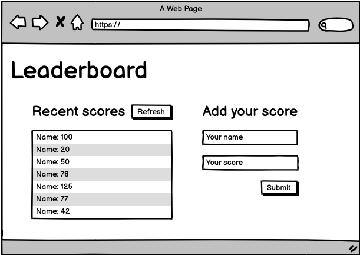

# Yuriy Chamkoriyski Leaderboard project

> JavaScript leaderboard project using API.

## Description

In this activity I will set up a JavaScript project for the Leaderboard list app, using webpack and ES6 features, notably modules. I should develop a first working version of the app following a wire frame, but without styling - just focus on functionality. In following activities, I will consume the Leaderboard API using JavaScript async and await and add some styling.

## Instructions:

- Use [Gitflow](https://github.com/microverseinc/curriculum-transversal-skills/blob/main/git-github/articles/gitflow.md)
- Create an npm project with [webpack](https://webpack.js.org/guides/output-management/#setting-up-htmlwebpackplugin)
- Write plain HTML markup with minimum styling (just to make the layout), because you will implement styles in the following steps
- Don't make API calls (you'll do it in a following lesson).
- Use ES6 modules, with import and export.

## Built With

- Major languages: HTML, CSS, JS
- Frameworks: none
- Technologies used: Git, webpack, API

## Live Demo

- Not deployed yet.

## Getting Started

To get a local copy up and running follow these simple example steps.

### Prerequisites

- Internet connection and browser
- A text editor(preferably Visual Studio Code)
- Browser

### Setup

- No setup required

### Install

- [Git](https://git-scm.com/downloads)
- [Node](https://nodejs.org/en/download/)

### Usage

- Clone the repository using `git clone git@github.com:Hombre2014/Leaderboard.git`
- Change directory into the project folder `cd Leaderboard`
- Run `npm install` from the terminal
- Run `npm start` from the terminal
- A new browser will open automatically with application loaded

### Run tests

- N/A

### Deployment

- All the files necessary for deployment are in the /dist folder

## Author

👤 **Yuriy Chamkoriyski**

- GitHub: [@Hombre2014](https://github.com/Hombre2014)
- Twitter: [@Chamkoriyski](https://twitter.com/Chamkoriyski)
- LinkedIn: [axebit](https://linkedin.com/in/axebit)

## 🤝 Contributing

Contributions, issues, and feature requests are welcome!

Feel free to check the [issues page](https://github.com/Hombre2014/Leaderboard/issues).

## Show your support

Give a ⭐️ if you like this project!

## Acknowledgments

## 📝 License

This project is [MIT](./license.md) licensed.